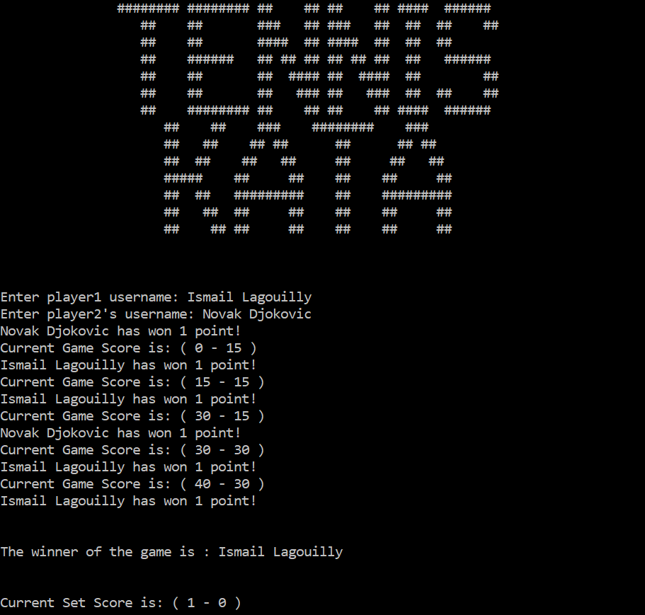

# Tennis-Kata-Java-Project

This Kata is about implementing a simple tennis game.

## What are the rules?

The rules could be found on this [file](https://github.com/Ilagouilly/Tennis-Kata-Java-Project/blob/main/KATA_Tennis.pdf).

## How can I compile the project locally?

```
mvn clean install
```

## How can I execute the project?

```
java -jar target/tennis-kata-1.0.0.jar
```


## Can I have a glimpse at it?

Of course!



## Can I have more information about this project?

Definitely, you find [here](https://www.blog.ismaillagouilly.com/tennis-kata-my-implementation-in-java-of-the-tennis-kata) the full article about this project on my blog.

Enjoy 😉
